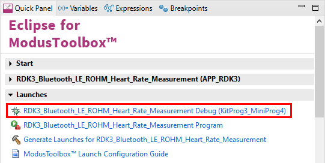

# RDK3 BLE ROHM Heart Rate Example

Rutronik Development Kit 3 Programmable System-on-Chip CYB06447BZI-BLD53 "RDK3 BLE ROHM BH1792 Heart Rate Sensor" Code Example. 

This code example demonstrates a BLE Heart Rate Service with a BH1792 optical heart rate sensor. 

The code example was written referring to the “[CE217639 - BLE Heart Rate with PSoC 6 MCU with BLE Connectivity](https://www.infineon.com/dgdl/Infineon-CE217639_BLE_Heart_Rate_with_PSoC_6_BLE-Code Example-v01_00-EN.pdf?fileId=8ac78c8c7d0d8da4017d0e6f765c039b)”

The evaluation kit [BH1792GLC-EVK-001](https://fscdn.rohm.com/en/products/databook/applinote/ic/sensor/optical_sensor_for_heart_rate_monitor/bh1792glc-evk-001_ug-e.pdf) from ROHM was used together with RDK3 for this code example development.

 

## Requirements

- [ModusToolbox™ software](https://www.cypress.com/products/modustoolbox-software-environment) v2.4

## The Provisioning of the RDK3

The CYB06447BZI-BLD53 device must be provisioned with keys and policies before being programmed. If the kit is already provisioned, copy-paste the keys and policy folder to the application folder. If the unsigned or not properly signed image will be written to the RDK3 PSoC™ 64 – the microcontroller will not boot. 

The “[Secure Policy Configurator](https://www.infineon.com/dgdl/Infineon-ModusToolbox_Secure_Policy_Configurator_1.30_User_Guide-UserManual-v01_00-EN.pdf?fileId=8ac78c8c8386267f0183a960762a5977)” tool is used for the provisioning of the new RDK3, please refer to the “ModusToolbox™ Secure Policy Configurator user guide”. 

The CYB06447BZI-BLD53 MCU must be powered from a 2.5V power source to be able to complete the provisioning. The RDK3 has an SMPS [Switching Mode Power Supply] which can be easily adjusted to provide 3.3V or 2.5V to the MCU by switching the slide-switch “SW1” on the bottom side of the board. 

Please note that the “[Secure Policy Configurator](https://www.infineon.com/dgdl/Infineon-ModusToolbox_Secure_Policy_Configurator_1.30_User_Guide-UserManual-v01_00-EN.pdf?fileId=8ac78c8c8386267f0183a960762a5977) 1.20” requires the KitProg3 to be set into the CMSIS-DAP mode. Please press the “PROG MODE” button on the RDK3 board's front side once. The DEBUG D5 yellow led will flash indicating the CMSIS-MODE activated.

### Using the code example with a ModusToolbox™ IDE:

1. Import the project: **File** > **Import...** > **General** > **Existing Projects into Workspace** > **Next**.
2. Select the directory where **"RDK3_BLE_ROHM_Heart_Rate"** resides and click  **Finish**.
3. Update the libraries using a **"Library Manager"** tool.
4. Select and build the project **Project ** > **Build Project**.

### Operation

The RDK3 is configured to act as a server that provides a “Heart Rate Service” with a “Heart Rate Measurement” characteristic. The server does the advertisement with the name “RDK3” and “Heart Rate Service” every 20 to 30 milliseconds indefinitely until a client is connected.  As soon as a client connects to the RDK3 HRS it starts receiving notifications with heart rate data. The BH1792 is capable of detecting a presence of a pulse that is notified to the client device as a “Sensor Contact”.

### Debugging

If you successfully have imported the example, the debug configurations are already prepared to use with a the KitProg3, MiniProg4, or J-link. Open the ModusToolbox™ perspective and find the Quick Panel. Click on the desired debug launch configuration and wait for the programming to complete and the debugging process to start.

## Legal Disclaimer

The evaluation board including the software is for testing purposes only and, because it has limited functions and limited resilience, is not suitable for permanent use under real conditions. If the evaluation board is nevertheless used under real conditions, this is done at one’s responsibility; any liability of Rutronik is insofar excluded. 

