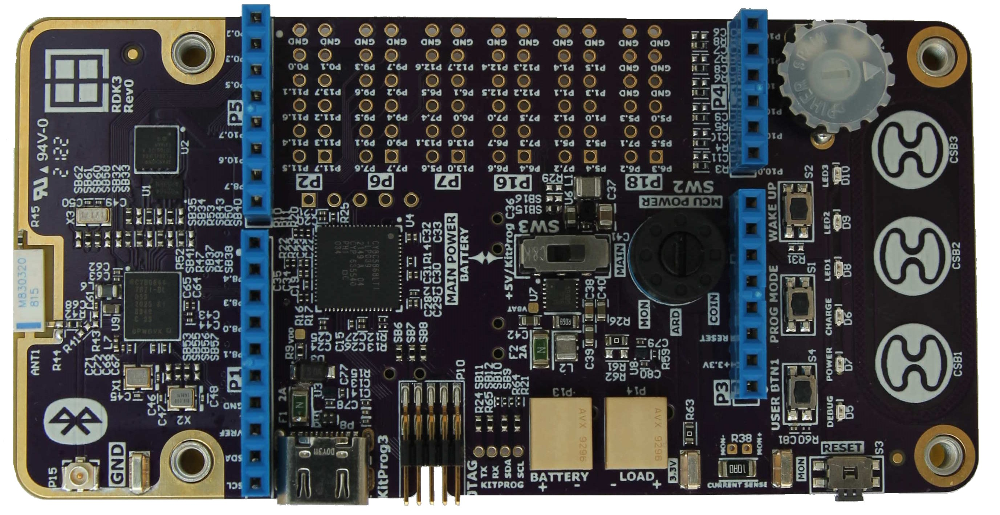
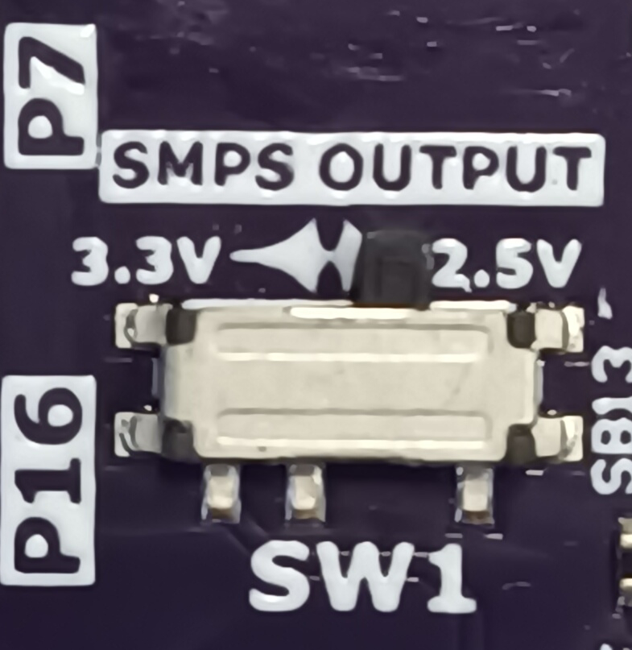
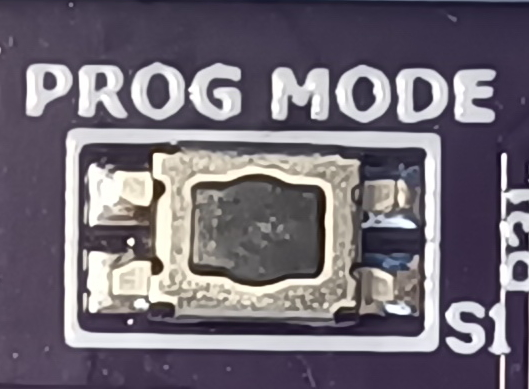

# RDK3 BSP

Rutronik Development Kit 3 Programmable System-on-Chip CYB06447BZI-BLD53 Board Support Package. 

## Requirements

- [ModusToolbox™ software](https://www.cypress.com/products/modustoolbox-software-environment) v3.0

## Features

- CYB06447BZI-BLD53 – Infineon’s High-Performance, Ultra-Low-Power secured MCU.
- All CYB06447BZI-BLD53 GPIOs are accessible via onboard headers.
-  On-board debugger KitProg3 with I2C and UART USB bridge.
-  10-pin Amphenol ICC SWD header for J-Link.
-  JAE USB Type-C connector for the KitProg3 debugger.
-  On-board capacitive buttons based on CapSense® CSX technology.
- APS1604M-3SQR-ZR - APMemory External QSPI 16Mbit PSRAM Memory.
- S25FL064LABNFI043 - Infineon External QSPI 64Mbit NOR Flash.
- M830320 - On-board 2.45GHz Bluetooth antenna from AVX.
-  U.FL connector for the external Bluetooth antenna from Amphenol RF.
- AVX multilayer ceramic transient voltage suppressors for the USB.
- AVX 9296 series POKE-HOME connectors.
- BD83070GWL - Switching mode power supply from ROHM.
- DIO59020CD12 - Li-ION Battery charger with USB-OTG Boost from DIOO.
- Keystone Electronics Corp. CR1220 coin battery socket for RTC and low-power applications.
- Current monitoring shunt resistor with Keystone Electronics Corp. P/N5019 test points.
- TOSHIBA Load Switches (with the current limiting capability) TCK1024G,LF.
- NISSHINBO low power amplifier NJU77001F.
- DIPTRONICS tactile buttons.
- Panasonic Right-angled tactile switch.
- C&K Rotary and Slider switch for power supply selections.
- PIHER Potentiometer for ADC peripheral evaluation.
- Passive components from Samsung EM, Yageo, and ASJ.
- CHILISIN Power Inductors.

## The Provisioning of the RDK3

The CYB06447BZI-BLD53 device must be provisioned with keys and policies before being programmed. If the kit is already provisioned, copy-paste the keys and policy folder to the application folder. If the unsigned or not properly signed image will be written to the RDK3 PSoC™ 64 – the microcontroller will not boot. 

The “[Secure Policy Configurator](https://www.infineon.com/dgdl/Infineon-ModusToolbox_Secure_Policy_Configurator_1.30_User_Guide-UserManual-v01_00-EN.pdf?fileId=8ac78c8c8386267f0183a960762a5977)” tool is used for the provisioning of the new RDK3, please refer to the “ModusToolbox™ Secure Policy Configurator user guide”. 

The CYB06447BZI-BLD53 MCU must be powered from a 2.5V power source to be able to complete the provisioning. The RDK3 has an SMPS [Switching Mode Power Supply] which can be easily adjusted to provide 3.3V or 2.5V to the MCU by switching the slide-switch “SW1” on the bottom side of the board. 

Please note that the “[Secure Policy Configurator](https://www.infineon.com/dgdl/Infineon-ModusToolbox_Secure_Policy_Configurator_1.30_User_Guide-UserManual-v01_00-EN.pdf?fileId=8ac78c8c8386267f0183a960762a5977) 1.20” requires the KitProg3 to be set into the CMSIS-DAP mode. Please press the “PROG MODE” button on the RDK3 board's front side once. The DEBUG D5 yellow led will flash indicating the CMSIS-MODE activated.

The evaluation board including the software is for testing purposes only and, because it has limited functions and limited resilience, is not suitable for permanent use under real conditions. If the evaluation board is nevertheless used under real conditions, this is done at one’s responsibility; any liability of Rutronik is insofar excluded. 

